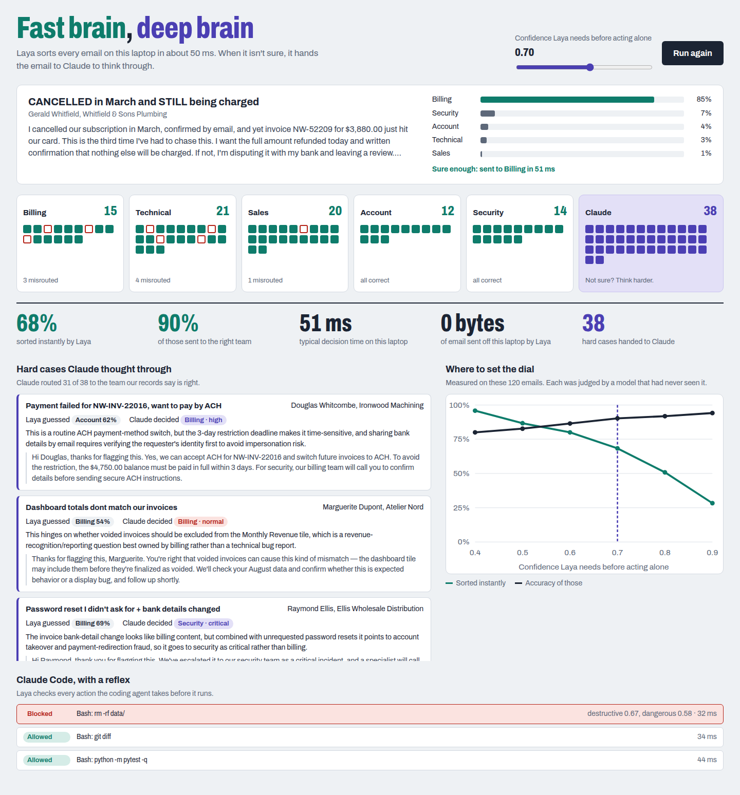
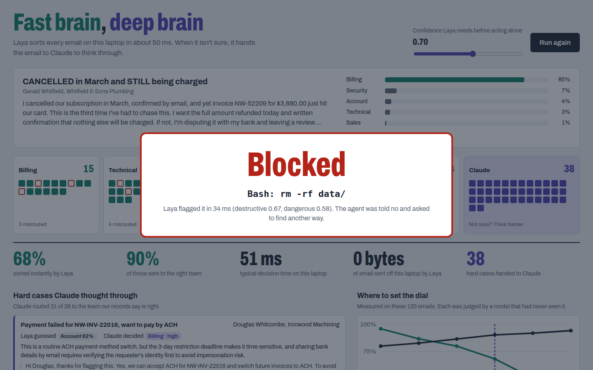

# Fast brain, deep brain

A live demo of two AI models working together on a laptop:

- **Laya** (open-source, 421M params) is the *fast brain*. It makes instant typed decisions on the local GPU, in about 50 ms and for free.
- **Claude** is the *deep brain*. It thinks through the cases Laya isn't sure about, and does the real work in Claude Code while Laya acts as its safety reflex.

The demo runs in three acts: sorting a 120-email inbox, escalating hard cases to Claude with a confidence dial, and blocking a coding agent's `rm -rf data/` in real time. Each act has its talk track in [DEMO.md](DEMO.md).



When the coding agent tries something destructive, Laya stops it before it runs:



## Setup
Tested on Linux with an RTX 4050 (6 GB) and Claude Code on a Pro plan.

```bash
uv venv ~/laya-env --python 3.12
uv pip install --python ~/laya-env/bin/python "laya[serve]==0.3.20" scikit-learn
~/laya-env/bin/python eval.py          # downloads weights, measures accuracy, writes cache/eval.json
./reset-demo.sh                        # creates demo-repo/ and demo-repo-unguarded/
~/laya-env/bin/python -m uvicorn app.server:app --host 127.0.0.1 --port 8765
```

Then open http://127.0.0.1:8765.

All emails in `data/inbox.jsonl`, and all credentials in `demo-template/.env`, are synthetic.

## How it talks to Claude (no API key needed)
The demo doesn't use the paid Claude API. It calls Claude through the Claude Code CLI (`claude -p`), signed in with a Claude Pro subscription. Usage counts against your plan's limits, not pay-per-token API credit.

If `ANTHROPIC_API_KEY` is set in your shell, `claude -p` would use that key instead of your subscription. So the app removes the variable before each call (see `ask_claude` in `app/server.py`). Do the same when you run Act 3 by hand:

```bash
unset ANTHROPIC_API_KEY
claude auth login    # only if you haven't signed in to Claude Code yet
```

Laya never makes network calls. It runs entirely on your GPU, and once the model weights are downloaded it works offline. If you have no Claude login at all, start the app with `CLAUDE_MODE=replay` to replay the cached answers in `cache/claude.json`.

## License

MIT. See [LICENSE](LICENSE). Laya itself is Apache-2.0.
